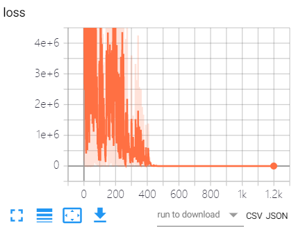
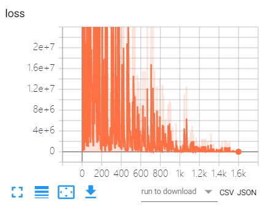
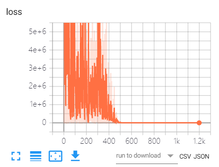
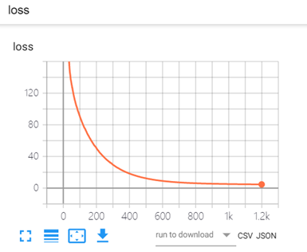
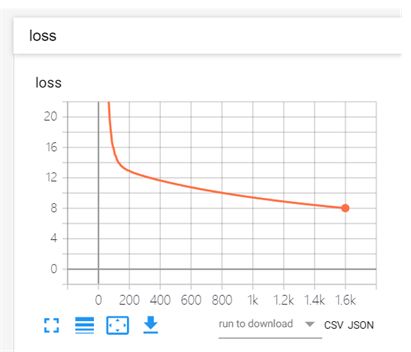
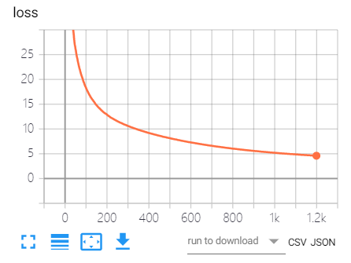
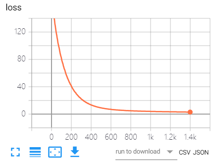
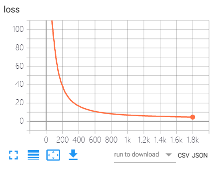
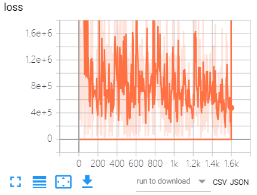

# 天池大赛新人赛挖掘幸福感  
参考了天池论坛中Mr_yang大佬的思路  
对其代码做局部修改并进行参数调试  
  
6个主成分  
两层神经网络：  
6\*16\*1  
Relu  
1200epoch，每批量20  
损失函数mean_squared_error  
优化函数 Adam  
最低loss 1.1  
波动特别大，感觉不是很靠谱。  
  
下面增加epoch大小试试  
6个主成分  
两层神经网络：  
6\*16\*1   
Relu  
1600epoch，每批量40  
损失函数mean_squared_error  
优化函数 Adam  
最低loss 10.73  
发现还是不行  
  
难道是成分选少了吗，增加两个主成分试试  
8个主成分  
两层神经网络：  
8\*16\*1   
Relu  
1200epoch，每批量20  
损失函数mean_squared_error  
优化函数 Adam  
最低loss 9.895  
结果发现还是没很大变化  
  
换个优化模型试试  
6个主成分  
两层神经网络：  
6\*16\*1   
Relu  
1200epoch，每批量20  
损失函数mean_squared_error  
优化函数 Adagrad  
最低loss 4.7  
看起来效果好了很多  
  
加大训练力度  
6个主成分  
两层神经网络：  
6\*16\*1   
Relu  
1600epoch，每批量40  
损失函数mean_squared_error  
优化函数 Adagrad  
最低loss 8.0  
好像反而更差了  
  
小步小步地增加训练epoch  
6个主成分  
两层神经网络：  
6\*16\*1   
Relu  
1400epoch，每批量40  
损失函数mean_squared_error  
优化函数 Adagrad  
最低loss 4.0  
还可以  
  
增加主成分会不会有所改变呢？  
8个主成分  
两层神经网络：  
8\*16\*1   
Relu  
1200epoch，每批量20  
损失函数mean_squared_error  
优化函数 Adagrad  
最低loss 4.6  
对比原来6个主成分的4.7下降了0.1  
  
加大epoch  
8个主成分  
两层神经网络：  
8\*16\*1   
Relu  
1400epoch，每批量20  
损失函数mean_squared_error  
优化函数 Adagrad  
最低loss 2.9  
哦吼，可以  
  
加大力度不要停  
8个主成分  
两层神经网络：  
8\*16\*1  
Relu函数  
1600epoch，每批量20  
损失函数mean_squared_error  
优化函数 Adagrad  
最低loss 2.6  
  
再加大试试  
8个主成分  
两层神经网络：    
8\*16\*1   
Relu函数    
1800epoch，每批量20  
损失函数mean_squared_error  
优化函数 Adagrad  
最低loss 4.7  
似乎不行了，再多就出事了  
  
此时如果再换一个优化模型呢？  
8个主成分  
两层  
8*16*1  
Relu  
1600epoch，每批量20  
损失函数mean_squared_error  
优化函数 Adadelta  
最低loss ？  
额。。。。算了不搞了。  

